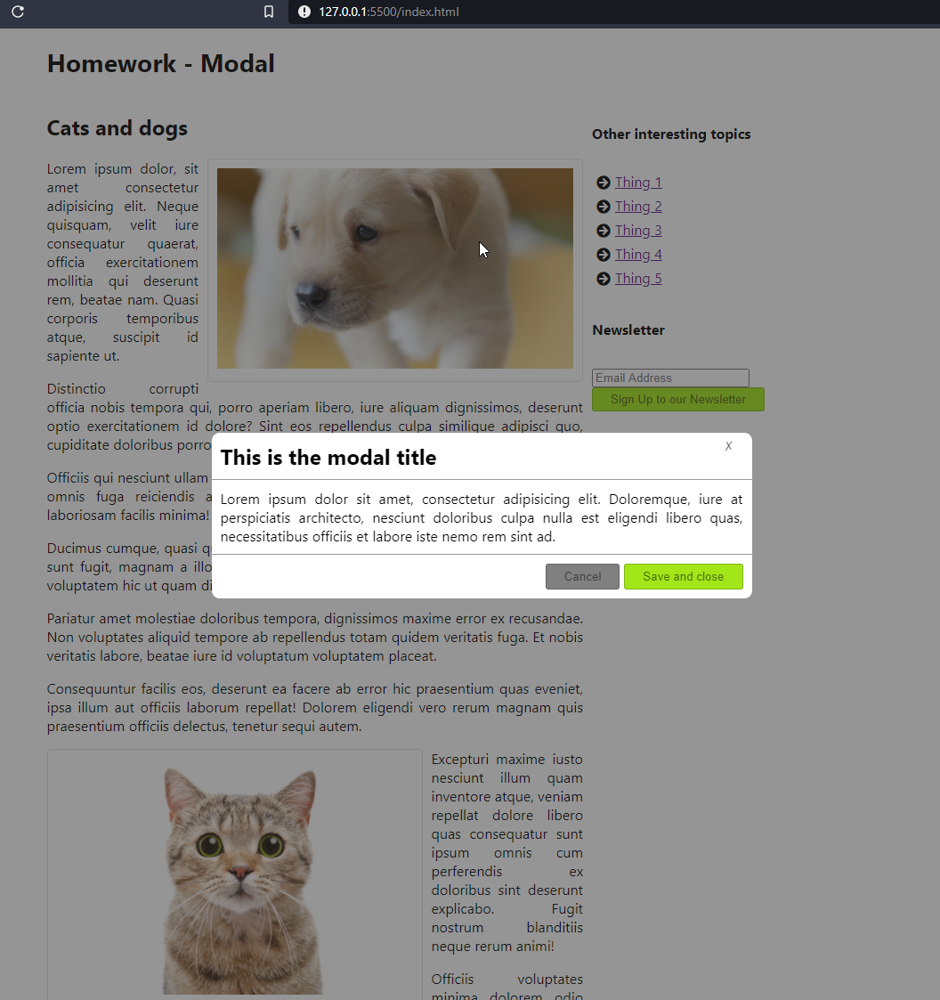
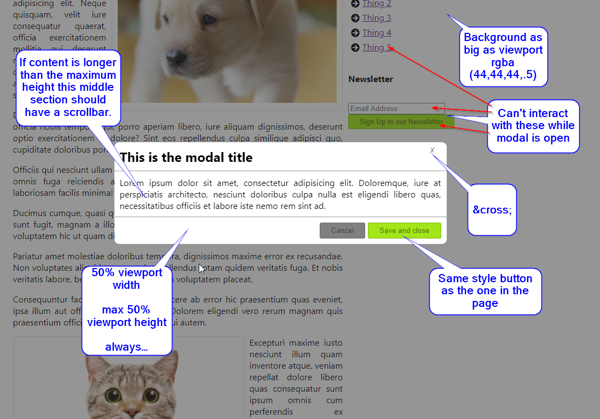

# Homework - Modal

Create a modal like the one in the image below.

It should be centered on the page and it should have semi-transparent background that does not allow interaction with the page below it.

The the modal should display over what has been provided for you. Also there is some CSS already present in the project, don't change anything that already exists, just add your own in the same file at the end, reuse what you can.

The modal should be always centered, regardless of scroll and have a width of 50% viewport plus a maximum height of 50% viewport height.

The middle section with text should scroll if there is no room for all the content.

Think how you could allow free height of modal. (Only center it horizontally and let it scroll with the page, how?) Comment out the code that would allow for this.

Helper image:

